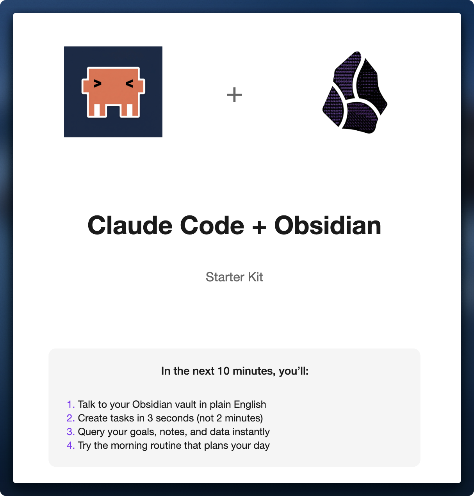
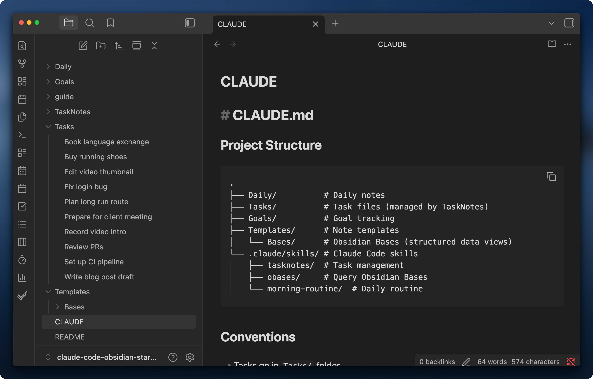

  

  📖 <strong><a href="guide/quick-start-guide.pdf">Full Guide (PDF)</a></strong> — Setup instructions with screenshots

---

## Quick Start

1. Clone: `git clone https://github.com/ArtemXTech/claude-code-obsidian-starter.git`
2. Open in Obsidian (trust plugins when prompted)
3. Run: `cd claude-code-obsidian-starter && claude`
4. Try: `"Show my goals"` or `"Create a task: Call mom tomorrow"`

---

*The starter kit vault with CLAUDE.md open*

---

## What's Inside

| Skill | Does |
|-------|------|
| 🔍 query | Read goals, tasks, notes |
| ✅ tasknotes | Create & manage tasks |
| ☀️ morning-routine | Daily planning workflow |

---

Made with <3 for the Obsidian community

By [Artem Zhutov](https://x.com/ArtemXTech)
